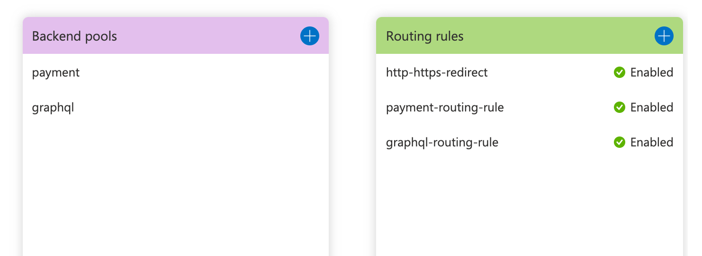

# Azure deployments

## Resource groups

MACH will create a **[resource group](https://registry.terraform.io/providers/hashicorp/azurerm/latest/docs/resources/resource_group) per site**.

!!! info ""
    Only when a [`resource_group`](../../syntax.md#azure_1) is explicitly set, it won't be managed by MACH.

## HTTP routing

Only when a MACH stack contains components that have an [`endpoint`](../../syntax.md#components) defined, MACH will setup the necessary resources to be able to route traffic to that component:

- Frontdoor instance
- DNS record

It will use the information from the [`frontdoor` configuration](../../syntax.md#frontdoor) to setup the Frontdoor instance.

### Routes to the component

For each component with an `endpoint` the MACH composer will add a route to the Frontdoor instance using the name of the component.

So when having the following components defined:

```yaml
components:
    - name: payment
      source: git::ssh://git@github.com/your-project/components/payment-component.git//terraform
      endpoint: main
      version: ....
    - name: api-extensions
      source: git::ssh://git@github.com/your-project/components/api-extensions-component.git//terraform
      version: ....
    - name: graphql
      source: git::ssh://git@github.com/your-project/components/graphql-component.git//terraform
      endpoint: main
      version: ....
```

The routing in Frontdoor that will be created:



## App service plan

MACH will create an [App service plan](https://registry.terraform.io/providers/hashicorp/azurerm/latest/docs/resources/app_service_plan) that can be used for any MACH component that implements an Azure function.

## Action groups

When an [Alert group](../../syntax.md#alert_group) is configured, an [Action group](https://registry.terraform.io/providers/hashicorp/azurerm/latest/docs/resources/monitor_action_group) will be created.

Components can use that action group to attach alert rules to.