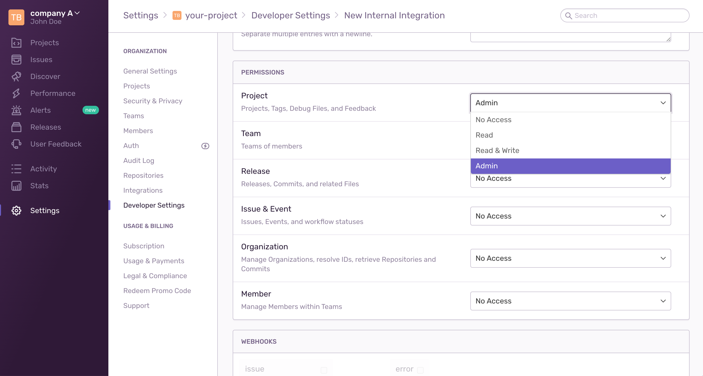

# Sentry

You can define a predefined Sentry [DSN](https://docs.sentry.io/product/sentry-basics/dsn-explainer) for your components to use during runtime to report to your Sentry project.

It's also possible for MACH to manage the keys (and DSN values) for you.
This allows you to generate a unique DSN per component as well as have fine-grained control over rate-limiting.

To let MACH manage your DSN values, you need to define a **auth token**, **project** and **organization**.

## Create auth token

Create a new internal integration and choose **Project: Admin** as permissions.<br>
The rest can be left empty.



## Configure MACH

Use that token to configure your MACH environment:

```yaml
---
general_config:
  environment: test
  cloud: aws
  sentry:
    auth_token: <auth-token>
    organization: companyA
    project: mach-services
    rate_limit_window: 21600
    rate_limit_count: 100
  ...
```

The rate limits can also be defined/overwritten on [`site`](../syntax.md#sites) and [`component`](../syntax.md#component-configurations) level

## Expose DSN to components

MACH needs to know what components want to use the Sentry DSN.<br>
For this you need to include `sentry` to the list of integrations.<br>
When doing so, MACH expects the component to have one variable `sentry_dsn` defined ([more info](../components/structure.md#sentry))

If the integration is set, MACH will;

- Generate a new DSN for the component
- Assign the DSN to the `sentry_dsn` variable